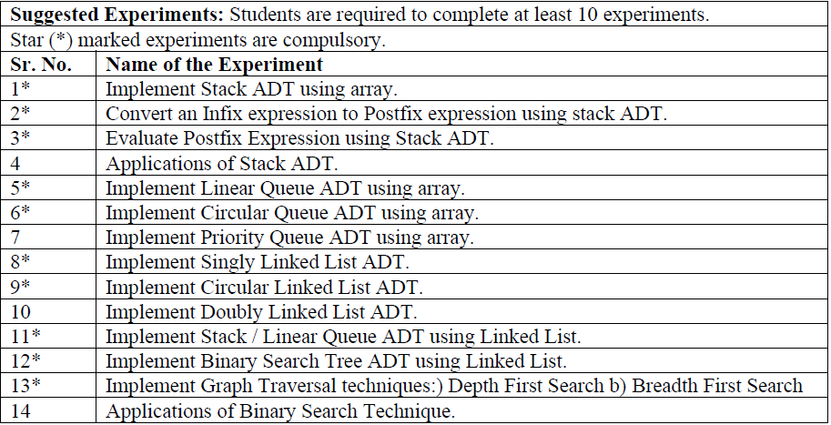

# MumbaiUni-CSE-DataStructurePrograms
Data Structure Lab Programs for the course CSC303 (Data Structure) in the Comps Department at the University of Mumbai.

These programs are useful for Semester 3 students studying in Computer Science. 

These are just some basic programs.

