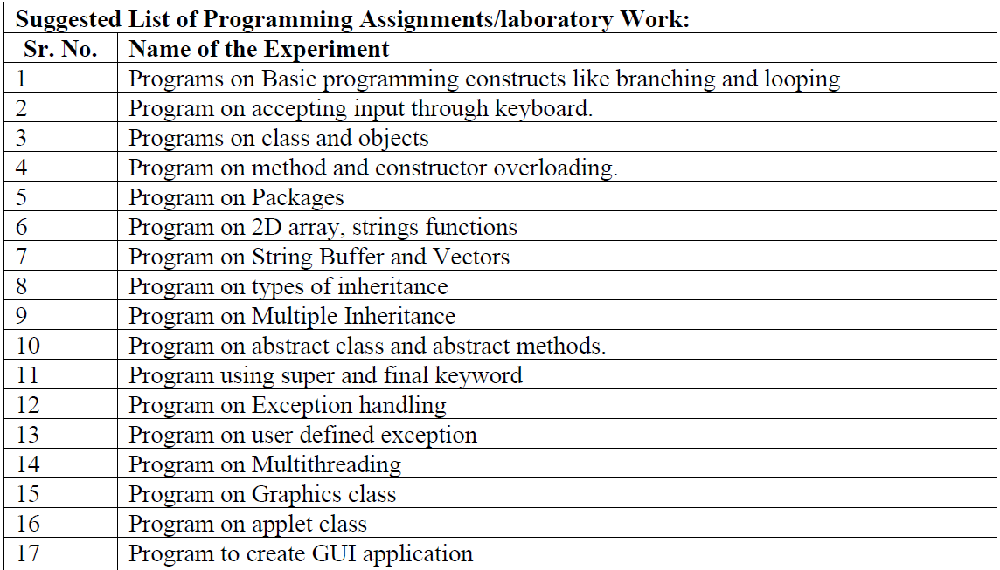

# MumbaiUni-CSE-SBL-JavaPrograms

JAVA Lab Programs for the course CSL304 (SBL-Skill Based Lab for JAVA) in the Comps Department at the University of Mumbai.

These programs are useful for Semester 3 students studying in Computer Science.

These are just some basic programs.

